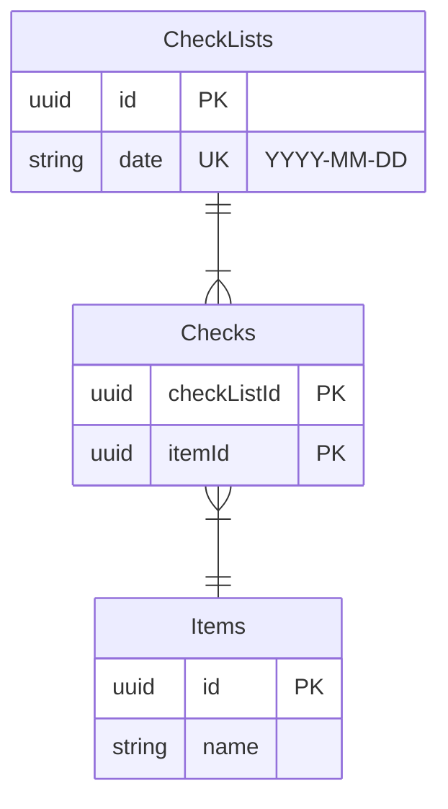

# kireta

## メモ

- tsukota との違い
  - Firebase Authentication -> 廃止
  - Cloud Functions -> Cloud Run
  - ...

## ERD

```mermaid
erDiagram
  CheckLists {
    uuid id PK
    string date UK "YYYY-MM-DD"
  }
  Checks {
    uuid checkListId PK
    uuid itemId PK
  }
  Items {
    uuid id PK
    string name
  }
  CheckLists ||--|{ Checks : ""
  Checks }|--|| Items : ""
```
